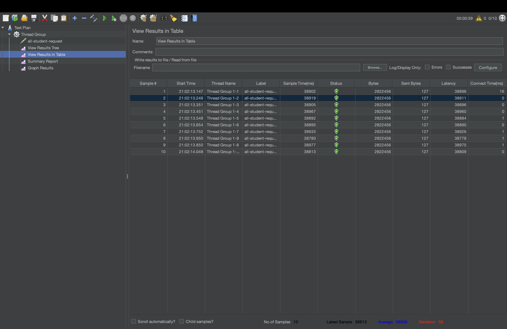
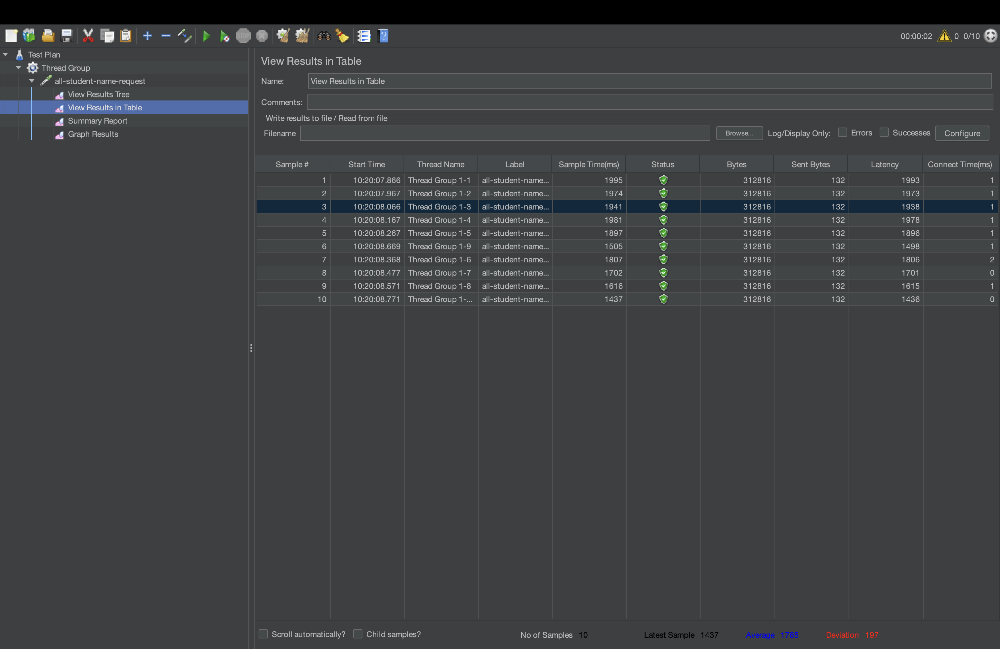
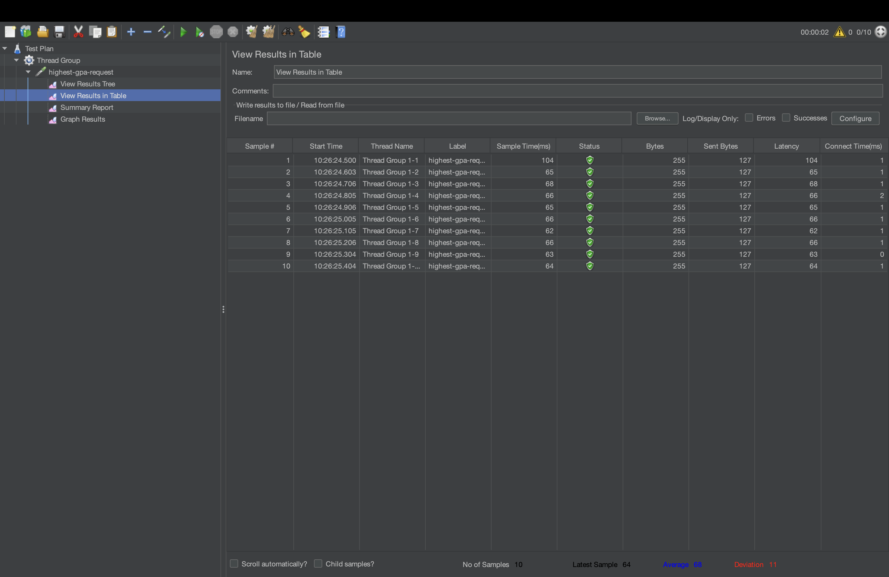
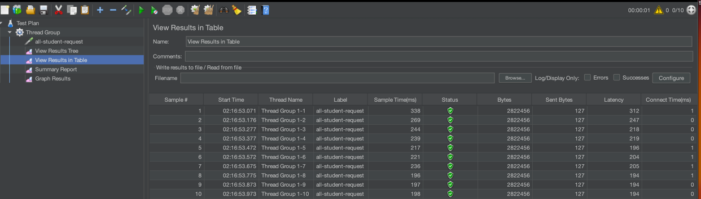
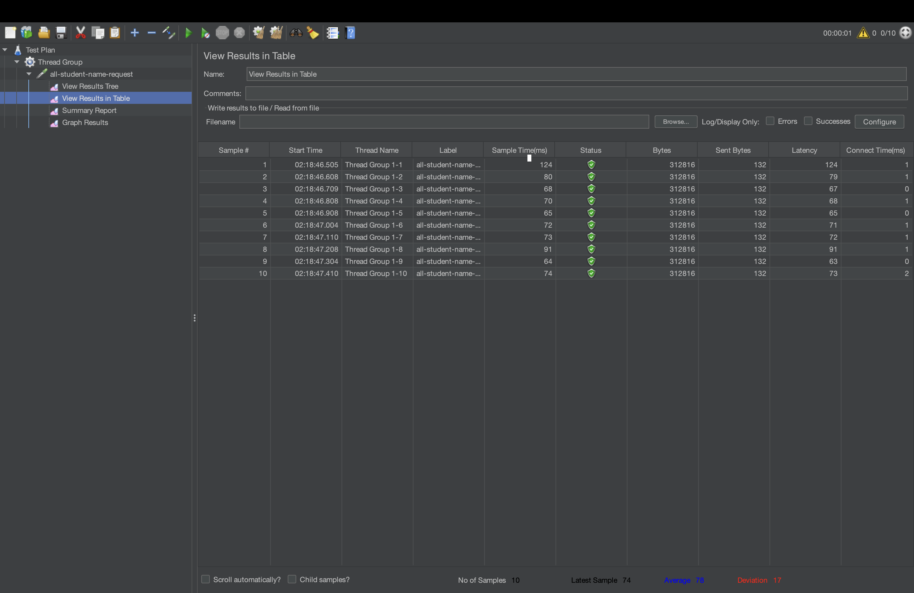
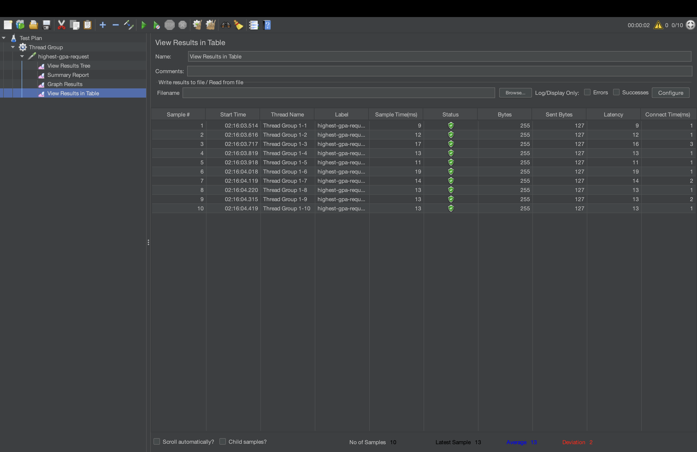
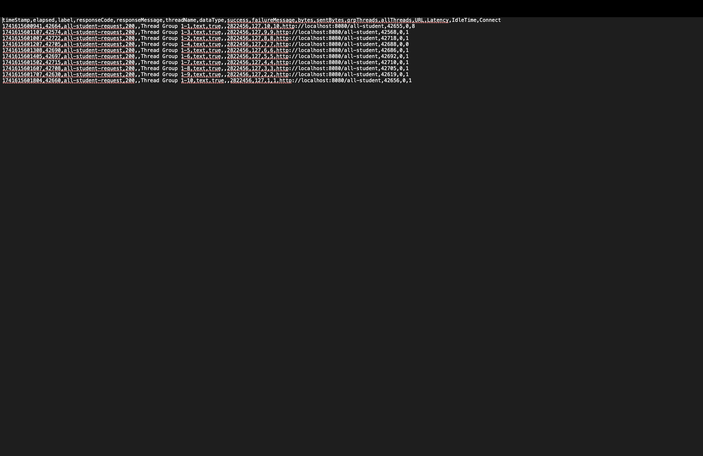
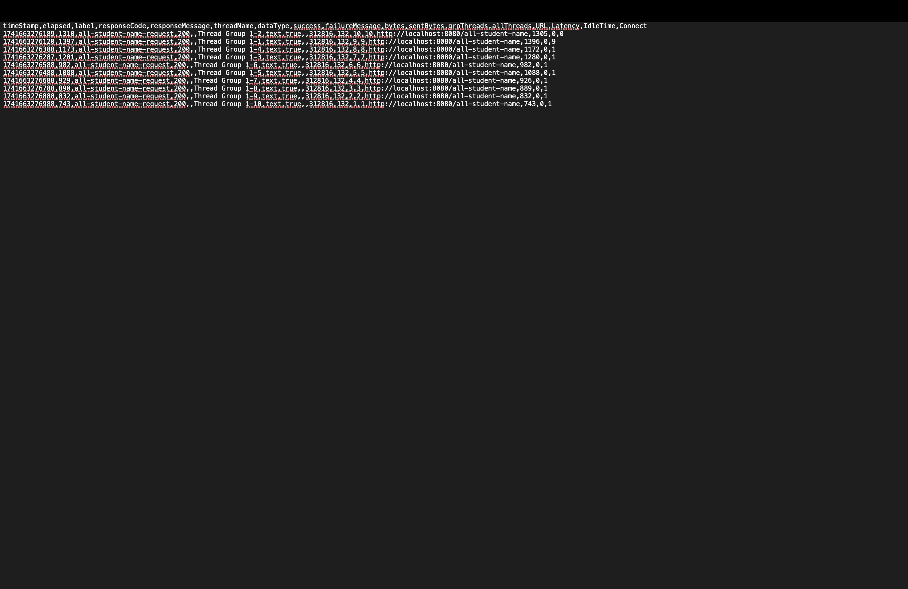
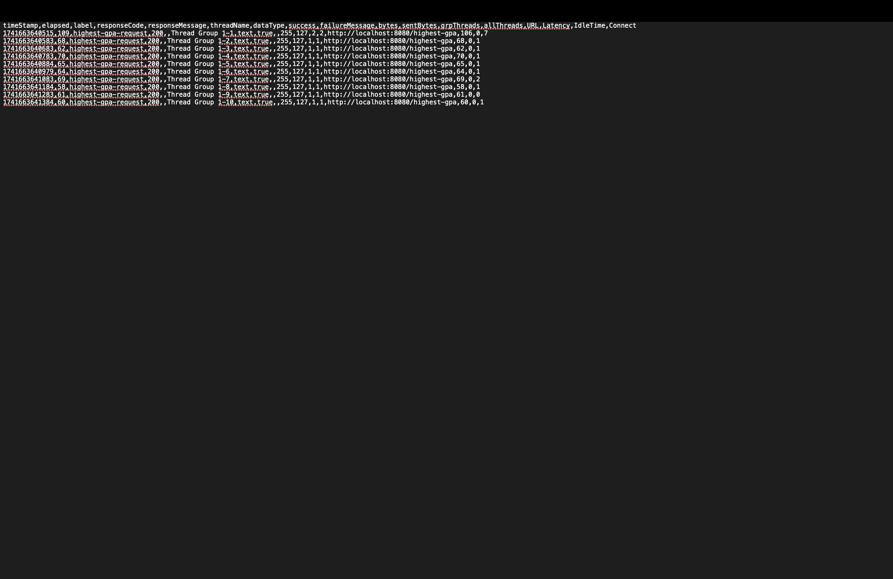

## Screenshots Before Optimization

## Screenshots after optimization

# Conclusion
Based on the JMeter “View Results in Table” screenshots, there is a significant reduction in response times after the optimization. This indicates that the applied optimizations have successfully reduced latency and improved overall performance.

## Screenshots of the execution results

# Reflection

## 1 What is the difference between the approach of performance testing with JMeter and profiling with IntelliJ Profiler in the context of optimizing application performance?
Performance testing with JMeter simulates real-world user load to assess overall system performance by measuring response times, throughput, and error rates under stress while profiling with IntelliJ Profiler dives into the application’s internal workings to provide detailed insights on CPU usage, memory allocation, and method call frequency to uncover code-level inefficiencies

## 2 How does the profiling process help you in identifying and understanding the weak points in your application?
The profiling process offers a deep analysis of how the application code executes by tracking resource consumption and highlighting inefficient methods through visual tools like call trees and flame graphs which makes it easier to pinpoint performance hotspots and understand where optimizations are needed

## 3 Do you think IntelliJ Profiler is effective in assisting you to analyze and identify bottlenecks in your application code?
IntelliJ Profiler is effective because it integrates seamlessly with the development environment, providing granular data and intuitive visualizations that allow for rapid identification of bottlenecks in the code while offering a detailed breakdown of resource usage

## 4 What are the main challenges you face when conducting performance testing and profiling, and how do you overcome these challenges?
The challenges include accurately simulating realistic production loads, ensuring that the test environment mirrors production conditions, and managing the additional overhead that profiling tools may introduce; these are overcome by using a combination of tools, refining test scenarios iteratively, and maintaining dedicated testing environments that closely replicate production

## 5 What are the main benefits you gain from using IntelliJ Profiler for profiling your application code?
The benefits of using IntelliJ Profiler include in-depth analysis of code execution, rapid diagnosis of performance issues through detailed metrics and visual feedback, and an integrated workflow that streamlines the process of identifying and addressing code-level bottlenecks

## 6 How do you handle situations where the results from profiling with IntelliJ Profiler are not entirely consistent with findings from performance testing using JMeter?
In cases where profiling and performance testing results differ, it is important to recognize that each tool focuses on different aspects of performance; aligning testing scenarios, cross-validating data, and refining configurations through an iterative approach helps reconcile discrepancies and provides a comprehensive view of both system-level and code-level performance

## 7 What strategies do you implement in optimizing application code after analyzing results from performance testing and profiling? How do you ensure the changes you make do not affect the application's functionality?
After analyzing performance testing and profiling results, I start by identifying inefficient patterns—in our case, the N+1 query problem where the method was fetching courses for each student individually. The immediate strategy was to refactor the code so that all necessary data is retrieved in a single query using JPQL with JOIN FETCH (or an entity graph), which eliminates redundant database calls and minimizes latency.

To ensure that these changes do not affect the application's functionality, I perform careful manual testing of critical features and conduct thorough peer code reviews. I also monitor the application in a staging environment, closely observing logs and performance metrics to catch any anomalies early on. These practices help me verify that the optimized code behaves as expected while achieving significant performance improvements.

